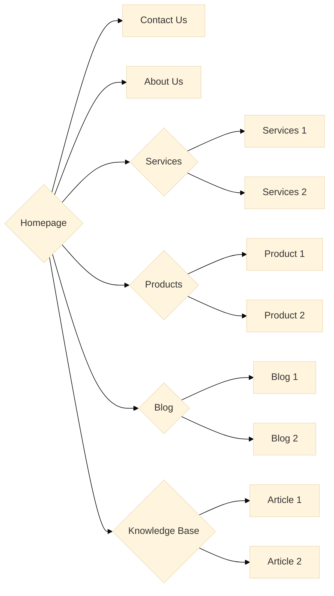
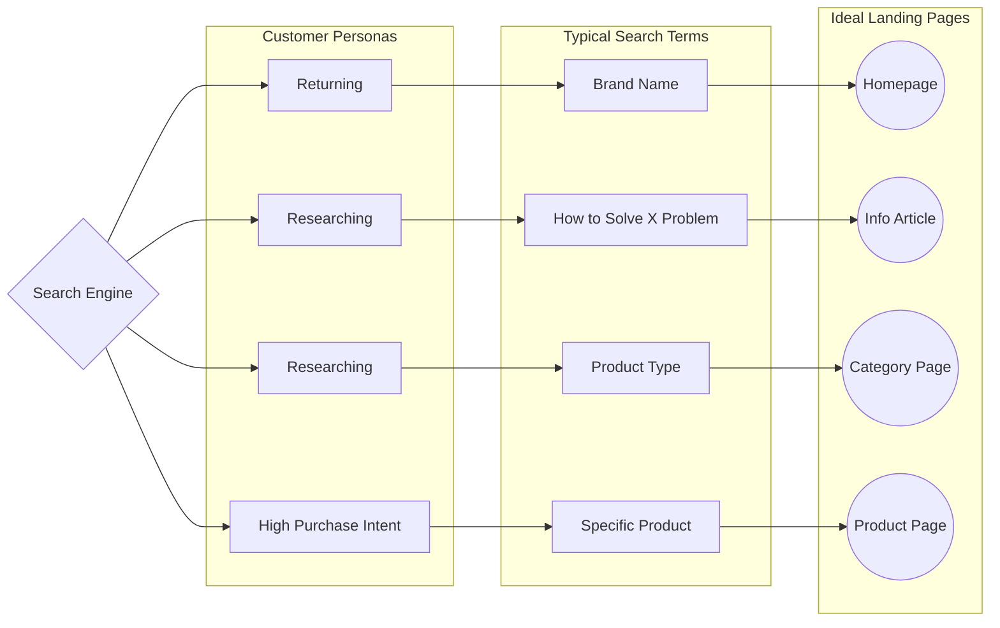
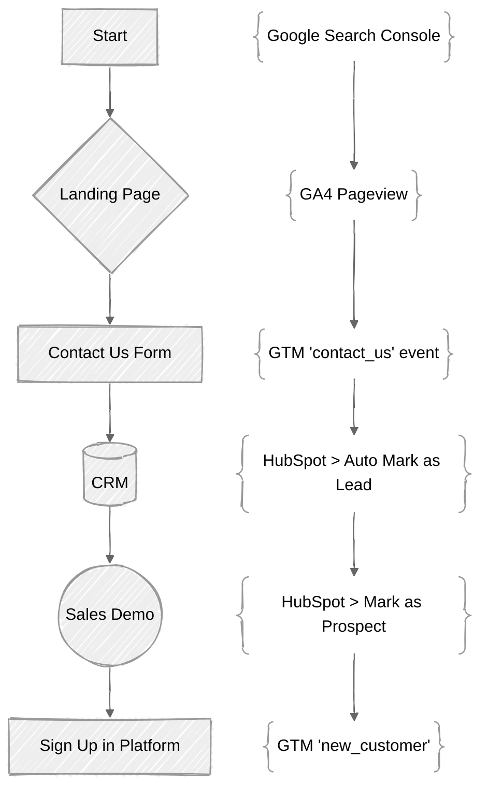

# Using Mermaid JS for Insanely Quick Diagramming

## Basic Sitemap

```mermaid
---
config:
  look: default
  theme: base
---
flowchart LR
  
  H{Homepage} --> C[Contact Us]
  H{Homepage} --> A[About Us]
    
  H{Homepage} --> S{Services}
  S{Services} --> S1[Services 1]
  S{Services} --> S2[Services 2]
  
  H{Homepage} --> P{Products}
  P{Products} --> AV1[Product 1]
  P{Products} --> AV2[Product 2]
  
  H{Homepage} --> B[Blog]
  B{Blog} --> B1[Blog 1]
  B{Blog} --> B2[Blog 2]
  
  H{Homepage} --> KB{Knowledge Base}
  KB{Knowledge Base} --> KB1[Article 1]
  KB{Knowledge Base} --> KB2[Article 2]
  
  %%Comments look like this!%%
```

## Search Intent vs Landing Pages

```mermaid
flowchart LR
  A{Search Engine} --> B1[Returning]
  A{Search Engine} --> B2[Researching]
  A{Search Engine} --> B3[Researching]
  A{Search Engine} --> B4[High Purchase Intent]
  
  B1[Returning] --> C1[Brand Name]
  B2[Researching] --> C2[How to Solve X Problem]
  B3[Researching] --> C3[Product Type]
  B4[High Purchase Intent] --> C4[Product Page]
  
  C1[Brand Name] --> D1((Homepage))
  C2[How to Solve X Problem] --> D2((Info Article))
  C3[Product Type] --> D3((Category Page))
  C4[Specific Product] --> D4((Product Page))
  
	subgraph Customer Personas
	  B1
	  B2
	  B3
	  B4
  end
  
  subgraph Typical Search Terms
	  C1
	  C2
	  C3
	  C4
  end
  
  subgraph Ideal Landing Pages
	  D1
	  D2
	  D3
	  D4
  end
```

## Highlighting Conversion Flow vs Analytics Events

```mermaid
---
config:
  look: handDrawn
  theme: neutral
---
flowchart TD

%%Customer flow%%
Start@{Search Engine} --> Land{Landing Page} --> Contact[Contact Us Form] --> CRM[(CRM)] --> Sales((Sales Demo)) --> Sign[Sign Up in Platform]
  
%%Analytics flow%%
Start-a@{ shape: braces, label: Google Search Console } 
--> S-a@{ shape: braces, label: GA4 Pageview}
--> B-a@{ shape: braces, label: GTM 'contact_us' event}
--> C-a@{ shape: braces, label: HubSpot > Auto Mark as Lead}
--> D-a@{ shape: braces, label: HubSpot > Mark as Prospect}
--> E-a@{ shape: braces, label: GTM 'new_customer'}
```

